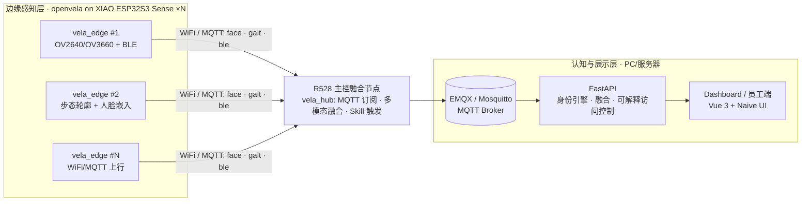

# 枢络 VelaMesh

> **分布式多模态无感感知与可解释访问控制系统** —— 以 openvela 为底座，XIAO ESP32S3 Sense 分布式边缘节点阵列融合人脸、步态、BLE 多模态身份证据，R528 主控节点做边缘融合与 Skill 触发，服务端 FastAPI + EMQX 承接认知层，Dashboard 实时呈现并解释每一次访问决策。

## 架构



物理链路：`R528 hub ← WiFi/MQTT ← ESP32-S3 edge ×N → FastAPI/EMQX → Dashboard`。

## 目录结构

模板通过 manifest `<linkfile>` 把 `app/`、`board/` 映射进 openvela 工作树；
`server/`、`client/`、`skills/`、`docs/`、`logs/` 不参与链接，仅随仓库存放。

```text
├── contest2026_212_zhijianzhirongdui.xml  # repo manifest（linkfile 映射）
├── openvela.xml                           # openvela 基础项目集（模板自带，勿改）
├── app/
│   ├── vela_edge/                         # 边缘从节点 NSH 应用（XIAO ESP32S3 Sense）
│   │   ├── vela_edge_main.c               #   Stage 1 可运行 stub 主循环
│   │   └── modules/                       #   移植自原工程的真实模块：
│   │                                      #   camera / gait / inference / ble / net / tools
│   └── vela_hub/                          # R528 主控融合节点 NSH 应用（Stage 1 stub）
├── board/
│   └── xiao_esp32s3_sense/                # 板级适配（“新硬件平台适配”载体）
│       ├── configs/nsh/defconfig          #   实测 vendor defconfig（WiFi/视频/OV3660/PSRAM）
│       ├── reference/                     #   移植的 BSP / camera DMA 源码（后续任务纳入编译）
│       └── CAMERA_DMA.md                  #   OV2640/OV3660 DMA 适配要点与诊断结论
├── server/                                # 服务端：FastAPI + MQTT + SQLite（run.sh 一键起）
├── client/                                # Web Dashboard / 员工端：Vue 3 + Vite + Naive UI
├── skills/                                # 融合节点 Skill（占位，下一任务填充）
├── deploy/demo/                           # 赛场离线双容器演示包（app + mosquitto）
├── docs/                                  # 方案、论文、调研报告、DMA 诊断、SOP
└── logs/                                  # AI Coding 日志（按官方手册导出并提交，不得伪造）
```

linkfile 映射（见 `contest2026_212_zhijianzhirongdui.xml`）：

| 仓内路径 | openvela 工作树位置 |
|---|---|
| `app/vela_edge` | `packages/demos/contest2026_212_vela_edge` |
| `app/vela_hub` | `packages/demos/contest2026_212_vela_hub` |
| `board/xiao_esp32s3_sense` | `vendor/openvela/boards/contest2026_212_xiao_esp32s3_sense` |

## 快速上手

### 路径 ① openvela 整仓（编译烧录 edge / hub）

```bash
repo init -u https://github.com/open-vela/contest2026_212_zhijianzhirongdui \
          -b dev-ai-contest-2026 \
          -m contest2026_212_zhijianzhirongdui.xml
repo sync
```

然后配置（defconfig 或 menuconfig）：

```text
CONFIG_LVX_USE_DEMO_CONTEST2026_212_VELA_EDGE=y
CONFIG_LVX_USE_DEMO_CONTEST2026_212_VELA_HUB=y
```

烧录后在 NSH 执行 `vela_edge`（从节点）与 `vela_hub`（融合节点）。Stage 1
均为可运行 stub，用于打通 manifest 与构建接线；真实模块源码已在
`app/vela_edge/modules/` 与 `board/xiao_esp32s3_sense/reference/` 就位，
后续任务按 Kconfig 特性开关（TFLITEMICRO / WiFi / BLE）接入编译。

### 路径 ② server：run.sh 一键起

```bash
cd server
cp .env.example .env          # 确认 MQTT_BROKER 与固件指向同一 broker
./run.sh
```

自动创建 venv、安装依赖、启动 FastAPI（默认 :8000），登录
`admin / admin123`，API 文档见 `/docs`。需要一个可达的 MQTT broker（EMQX 或
Mosquitto）。离线赛场用 `deploy/demo/` 双容器包，流程见
`docs/competition-demo-runbook.md`。

### 路径 ③ client：npm i && npm run dev

```bash
cd client
npm install
npm run dev
```

类型检查 `npm run typecheck`，生产构建 `npm run build`（产物由 Dockerfile
拷入服务端静态目录）。

## 硬件清单

| 角色 | 硬件 | 数量 | 定位 |
|---|---|---|---|
| 边缘从节点 | Seeed XIAO ESP32S3 Sense（N16R8 + OV2640 扩展板，可换 OV3660） | 多块（演示 3 块） | 摄像头 DMA 采集、步态预过滤、MobileFaceNet 嵌入、BLE 扫描、MQTT 上行 |
| 主控融合节点 | Allwinner R528 运行 openvela | 1 | 订阅证据、多模态融合、访问决策、Skill 触发 |
| Broker/认知层 | EMQX/Mosquitto + FastAPI on PC | 1 套 | 持久化、身份引擎、可解释规则、WebSocket 推送 |
| 网络 | 2.4GHz WiFi AP | 1 | 边缘节点与 hub/server 同网段 |
| 辅材 | BLE 工牌/手机、PCB 底板、3D 打印外壳 | 若干 | 员工 BLE 标识与结构件 |

## 文档索引

**方案与论文**

- [统一技术方案设计（研电赛 Seeed 与小米赛道兼报）](docs/统一技术方案设计-研电赛Seeed与小米赛道兼报.md)
- [技术论文：基于 openvela 的分布式协同感知与身份融合系统](docs/技术论文-基于openvela的分布式协同感知与身份融合系统.md)
- [多模态身份确认技术调研与方案设计](docs/多模态身份确认技术调研与方案设计.md)
- [基于身份融合与访问控制的大语言模型及多智能体系统架构研究报告](docs/基于身份融合与访问控制的大语言模型及多智能体系统架构研究报告.md)
- [产品需求文档](docs/product-requirements.md)

**边缘侧 / 板级**

- [XIAO ESP32S3 Sense 板级说明](board/xiao_esp32s3_sense/README.md)
- [Camera DMA 适配要点（OV2640/OV3660）](board/xiao_esp32s3_sense/CAMERA_DMA.md)
- [OV3660 DMA 调试完整流程总结](docs/DMA调试完整流程总结.md)
- [摄像头 DMA 异常诊断与系统级可行性深度评估报告](docs/OpenVela-移植至-Seeed-Studio-XIAO-ESP32S3-Sense：摄像头-DMA-异常诊断与系统级可行性深度评估报告.md)
- [SOP-v2-XIAO-ESP32S3-OpenVela](docs/SOP-v2-XIAO-ESP32S3-OpenVela.md)
- [固件侧 esp-nn / TFLM 汇编记录与补丁](docs/firmware/)

**专项调研 / 服务端 / 演示**

- [BLE 无感识别调研报告](docs/BLE无感识别调研报告.md)
- [端侧 AI 模型选型推荐方案](docs/端侧AI模型选型推荐方案.md)
- [Gait MQTT 适配说明](docs/gait_frontend_adapter.md)
- [赛场离线演示 runbook](docs/competition-demo-runbook.md)
- [`server/DESIGN.md`](server/DESIGN.md) / [`server/API-DESIGN.md`](server/API-DESIGN.md)
- [`deploy/demo/README.md`](deploy/demo/README.md)

## 旧名兼容说明

作品由 **Dominiscius · 知鉴** 更名为 **枢络 VelaMesh**。品牌文案已全部替换；
为不破坏运行中的系统，下列旧拼写标识符刻意保留，不是更名不彻底：

- SQLite 数据库文件名 `data/dominiscius.db`（代码与 `.env.example` 已注释说明）；
- MQTT client id 默认值 `dominiscius-server`；
- 日志文件名 `dominiscius.log`；
- 固件写死、独立于 `vela/` 命名空间的步态 topic 根 `dominiscius/+/gait/result`；
- `deploy/demo/` 的 `DOMINISCIUS_IMAGE` 变量、镜像名 `dominiscius-demo:0.2.0`、
  容器/网络名与离线备份文件名。

环境变量名/配置键同理保持旧拼写，避免改名导致跑不起来；各保留点旁均有注释。

## 许可证

[Apache License 2.0](LICENSE) · Copyright 2026 智鉴融合队
